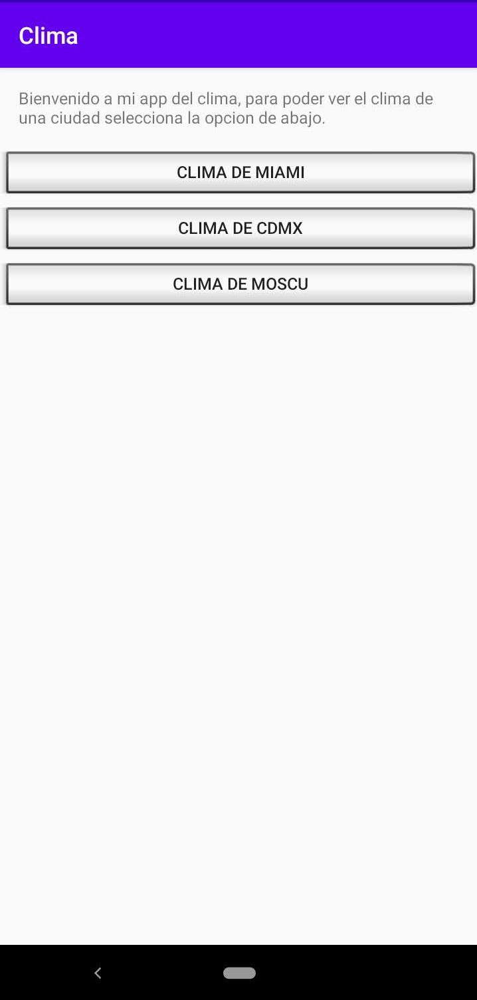
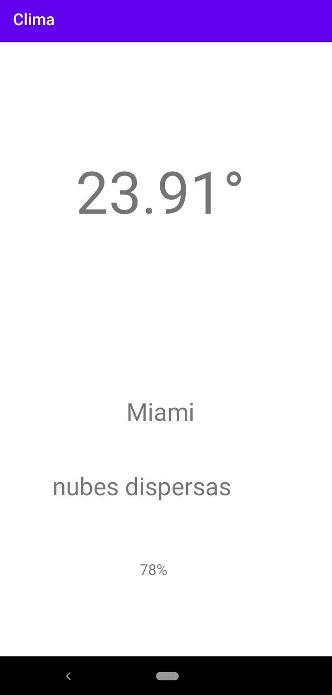
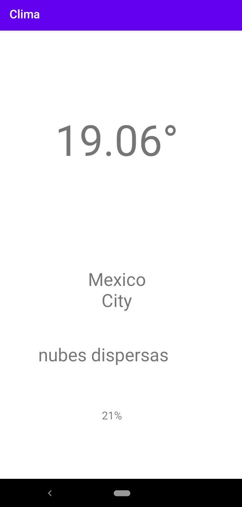

# App Clima

## Descripcion
Esta aplicacion hecha en android studio usando <strong>kotlin</strong>, tambien se uso una librería http <strong>Volley </strong>, la api <a href="https://openweathermap.org">openweathermap.org</a> de aquí salieron los valores de clima,ciudad y mas...

## Capturas
### Pantalla principal  
### Pantalla Secundaria (Escogiendo una opcion)  
## Pantalla Secundaria (Escogiendo otra opcion)  
